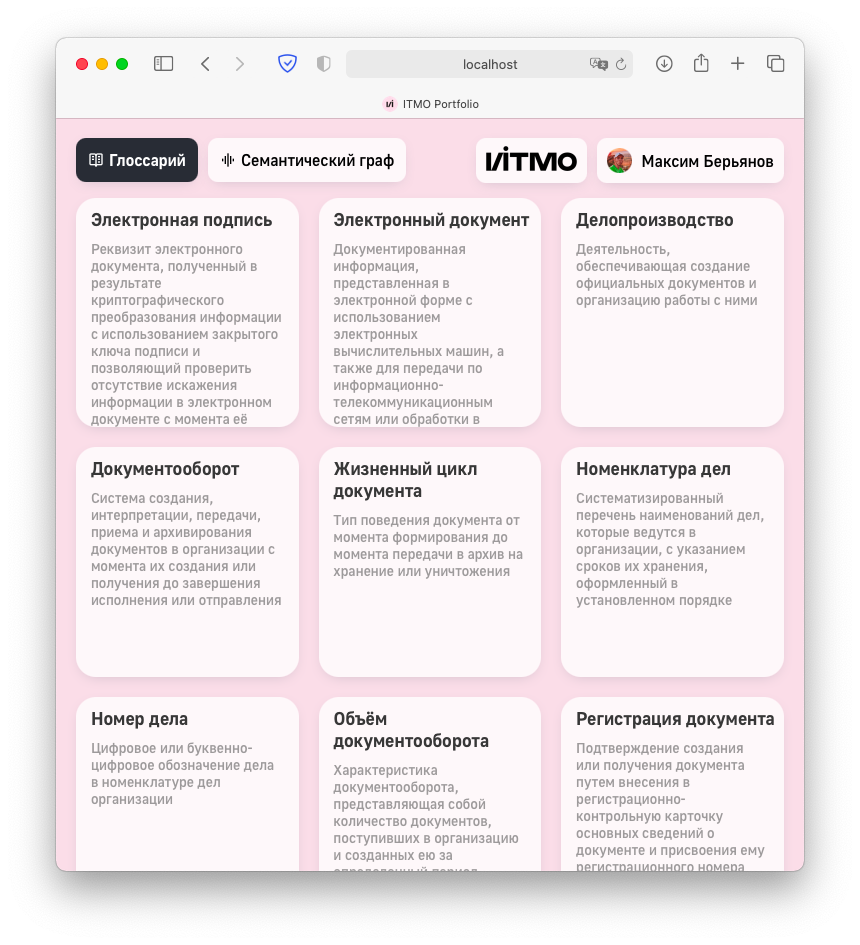
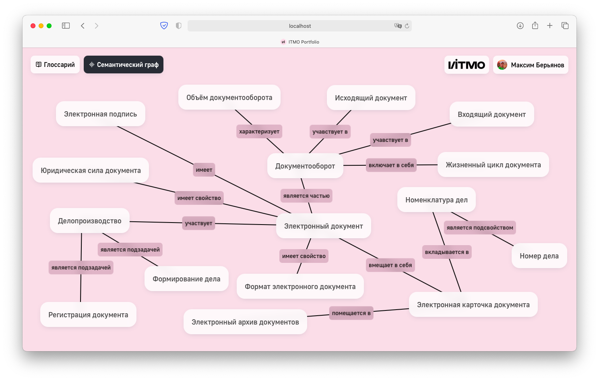

# ITMO Tech Lab

### Written in React.js

Here you can see some screenshots:

The glossary page card is adaptive:

The graph is dynamic: 

You can see how it looks on YouTube: https://youtu.be/khvn0-HqCKE
